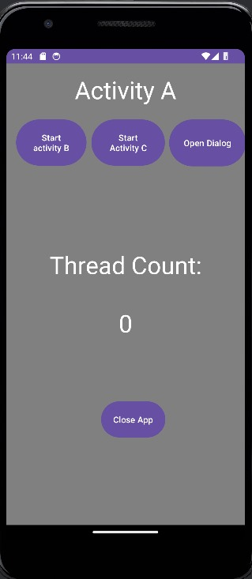

CMPE-277  Assignment

Activity Lifecycle

In our app, we've increased the thread counter each time the Main Activity restarts to show that reopening previous activities like Activity B or Activity C triggers the onRestart() method, adding 5 to the counter. However, when we open a dialog Activity and return to the previous one, onRestart() isn't invoked, leaving the thread counter unchanged.

Home screen:

 

Activity B opened:
 

 
Count incremented by 5:
 

 
 
Activity C opened:
 

 
Count incremented to 15:
 
 

 
Dialog opened:
 
 

 
Count remains unchanged:
 
 

